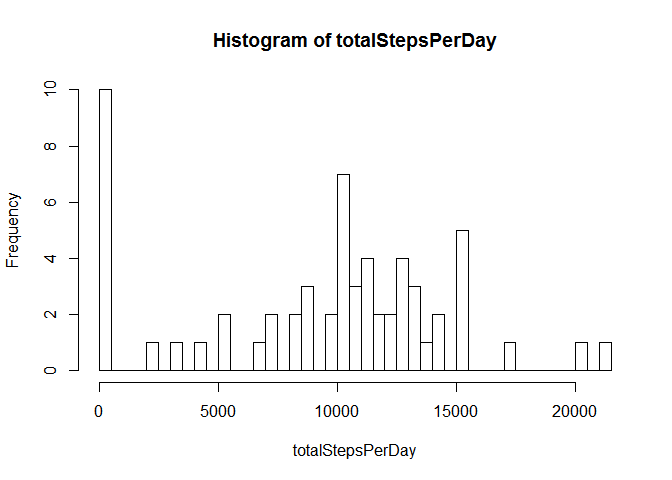
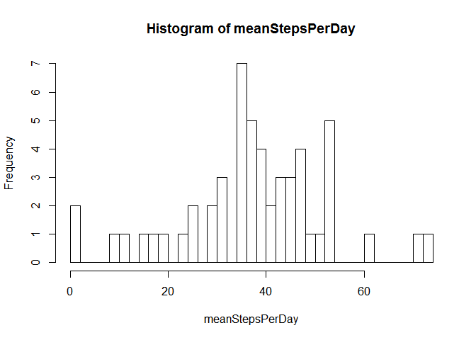
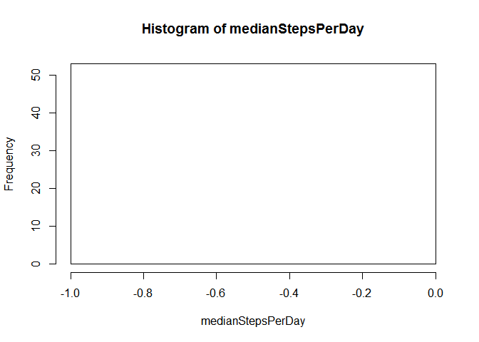
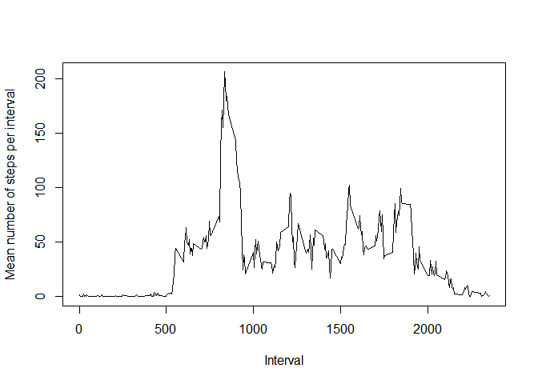
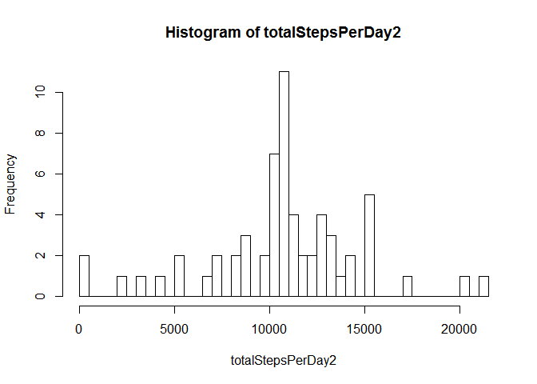
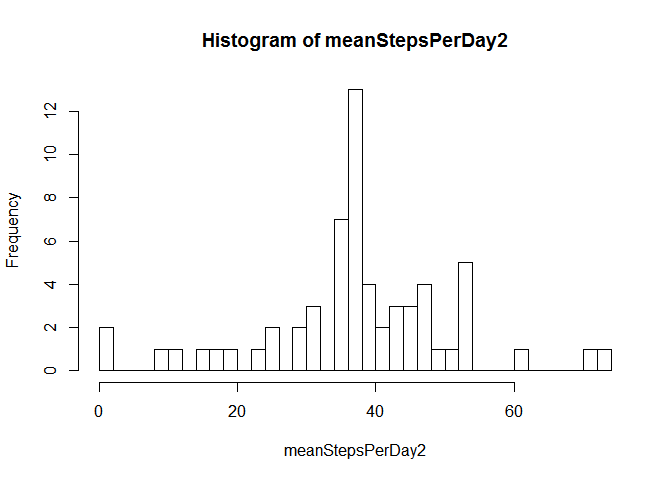
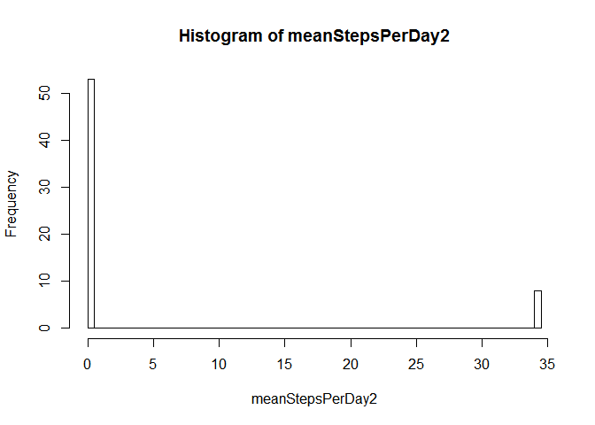
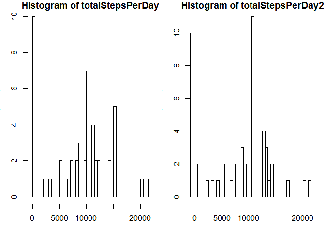
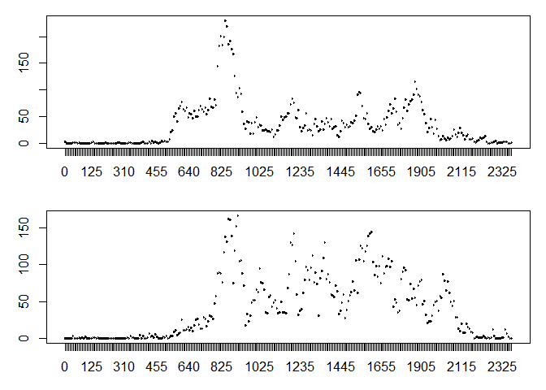

# Reproducible Research: Peer Assessment 1


## Loading the data
Use the read.csv command to read in the data.

```r
activity <- read.csv("activity.csv")
```


## What is mean total number of steps taken per day?
First histogram is showing the total number of steps per day split up in 50 bins. It looks like this person just stayed in bed for 10 days, but that result is due to missing values.

```r
totalStepsPerDay <- tapply(activity$steps,activity$date,sum, na.rm=TRUE)
hist(totalStepsPerDay, breaks = 50)
```

\
The average number of steps has a very similar distribution as the total number of steps as seen in the next histogram

```r
meanStepsPerDay <- tapply(activity$steps,activity$date,mean, na.rm=TRUE)
hist(meanStepsPerDay, breaks = 50)
```

\
Because of the number of 0 steps taken in most of the intervals the median is zero all the way through.

```r
medianStepsPerDay <- tapply(activity$steps,activity$date,median, na.rm=TRUE)
hist(medianStepsPerDay, breaks = 50)
```

\
## What is the average daily activity pattern?
Create factor variable for interval and use the tapply function to calculate the average number of steps during each interval. I created a new dataframe corresponding to the length of the interval variable.

```r
activity$intervalF <- as.factor(activity$interval)
timeSeries <- as.data.frame(tapply(activity$steps,activity$intervalF,mean, na.rm = TRUE))
names(timeSeries) <- "meansteps"
plot(rownames(timeSeries),timeSeries$meansteps,type = "l", xlab = "Interval", ylab = "Mean number of steps per interval") 
```

\
From the plot it is already clear that the morning is a busy time and if we search for the maximum steps in an interval we see that it is at 8:35 am.

```r
rownames(timeSeries[apply(timeSeries, 2, which.max),0])
```

```
## [1] "835"
```

## Imputing missing values
The length of total number of missing values is 2304 for the data set. If we look at the steps variable specifically we see that it is also 2304, and hence we only have missing values in the steps variable.

```r
length(which(is.na(activity==T)))
```

```
## [1] 2304
```

```r
length(which(is.na(activity$steps==T)))
```

```
## [1] 2304
```
The strategy to replace the missing vales is shown in the comments of the following code. 

```r
# Fill the NA with the mean of that 5 minute interval
#   Strategy and implementation
# 1: New data frame with all activity data and a new columns that has mean for the corresponding interval
timeSeries$int <- as.integer(rownames(timeSeries))
activ <- merge(activity,timeSeries,by.x = "interval" ,by.y="int", all = TRUE, sort = FALSE)
library(plyr)
activ <- arrange(activ, activ$date, activ$interval)
# 2: Replace all NA values with it's interval corresponding average.
activ$steps[which(is.na(activ$steps==T))] <- activ$meansteps[which(is.na(activ$steps==T))]
# 3: Remove again the added columns
activ <- activ[,c(3,2,1,4)] 
```
Check again the number of missing values to make sure it is zero now.

```r
length(which(is.na(activ==T)))
```

```
## [1] 0
```
The following three plots can be compared to the first three of the report. You can see that number days with very low amount of steps has drastically reduced.

```r
# Calculate number of steps per day
totalStepsPerDay2 <- tapply(activ$steps,activ$date,sum, na.rm=TRUE)
# Plot in a histogram
hist(totalStepsPerDay2, breaks = 50)
```

\

```r
# Calculate mean of steps per day
meanStepsPerDay2 <- tapply(activ$steps,activ$date,mean, na.rm=TRUE)
# Plot in a histogram
hist(meanStepsPerDay2, breaks = 50)
```

\

```r
# Calculate median of steps per day
meanStepsPerDay2 <- tapply(activ$steps,activ$date,median, na.rm=TRUE)
# Plot in a histogram
hist(meanStepsPerDay2, breaks = 50)
```

\
For a direct next to each (with and without missing values) other comparison.

```r
# Days with total nuber of near zero steps has decreased drastically and for higher values of steps per day the frequency has increased. A total of more steps per day on average.
par(mfrow = c(1,2),mar = c(3,3,1,1))
hist(totalStepsPerDay, breaks = 50)
hist(totalStepsPerDay2, breaks = 50)
```

\

## Are there differences in activity patterns between weekdays and weekends?


```r
# Create weekend weekday factor variable
activ$weekday <- weekdays(as.Date(activ$date))
wd <- c('Monday', 'Tuesday', 'Wednesday', 'Thursday', 'Friday')
activ$weekday <- factor((activ$weekday %in% wd), levels=c(FALSE, TRUE), labels=c('weekend', 'weekday'))

# Plot
toPlot <- aggregate(steps ~ intervalF + weekday, data= activ, function(x) mean(x))
par(mfrow = c(2,1),mar = c(3,3,1,1))
plot(toPlot$intervalF[toPlot$weekday=="weekday"], toPlot$steps[toPlot$weekday=="weekday"], type = "l")
plot(toPlot$intervalF[toPlot$weekday=="weekend"], toPlot$steps[toPlot$weekday=="weekend"], type = "l")
```

\
